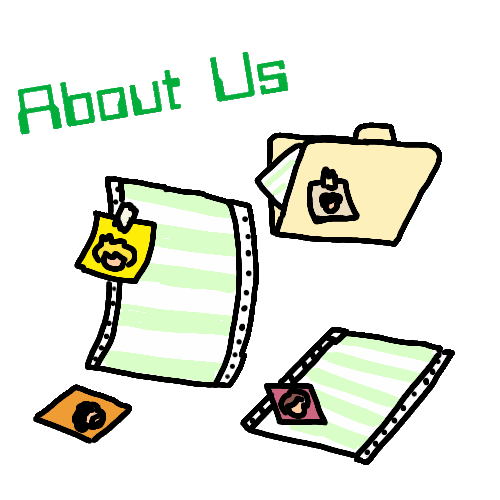
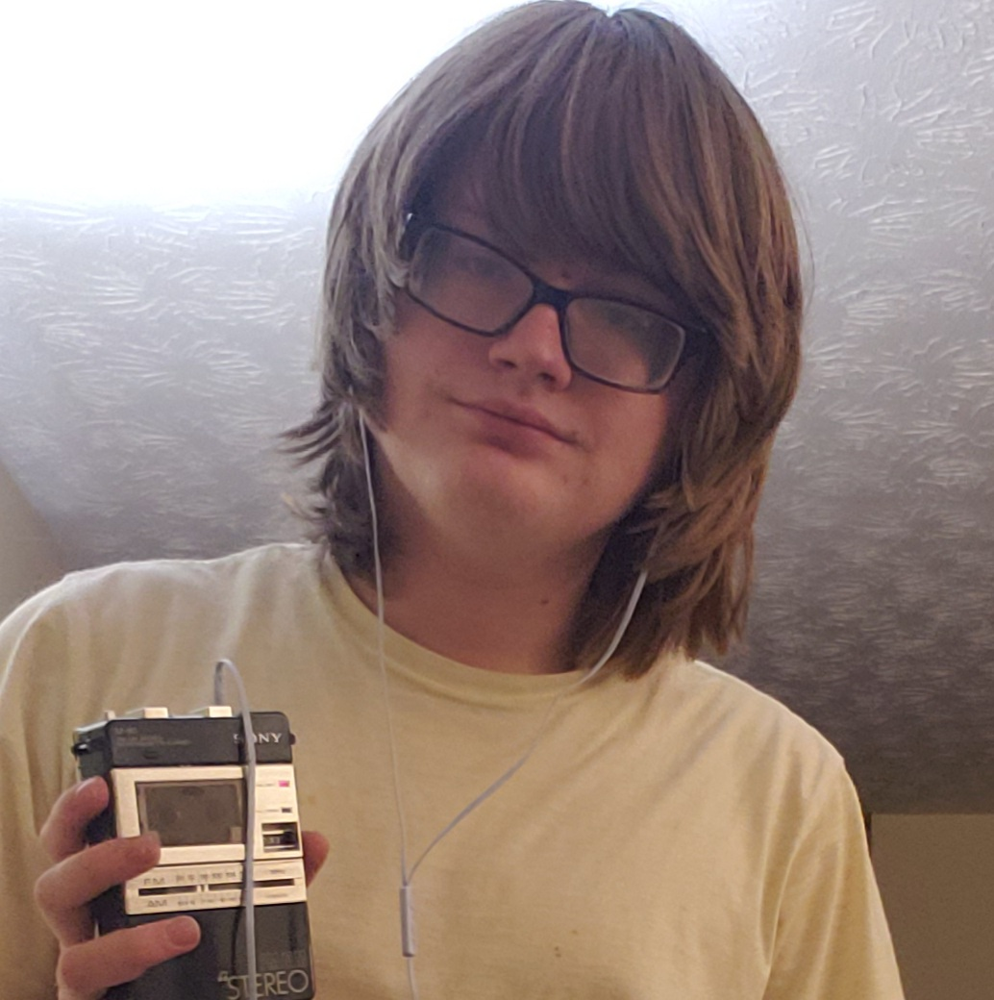
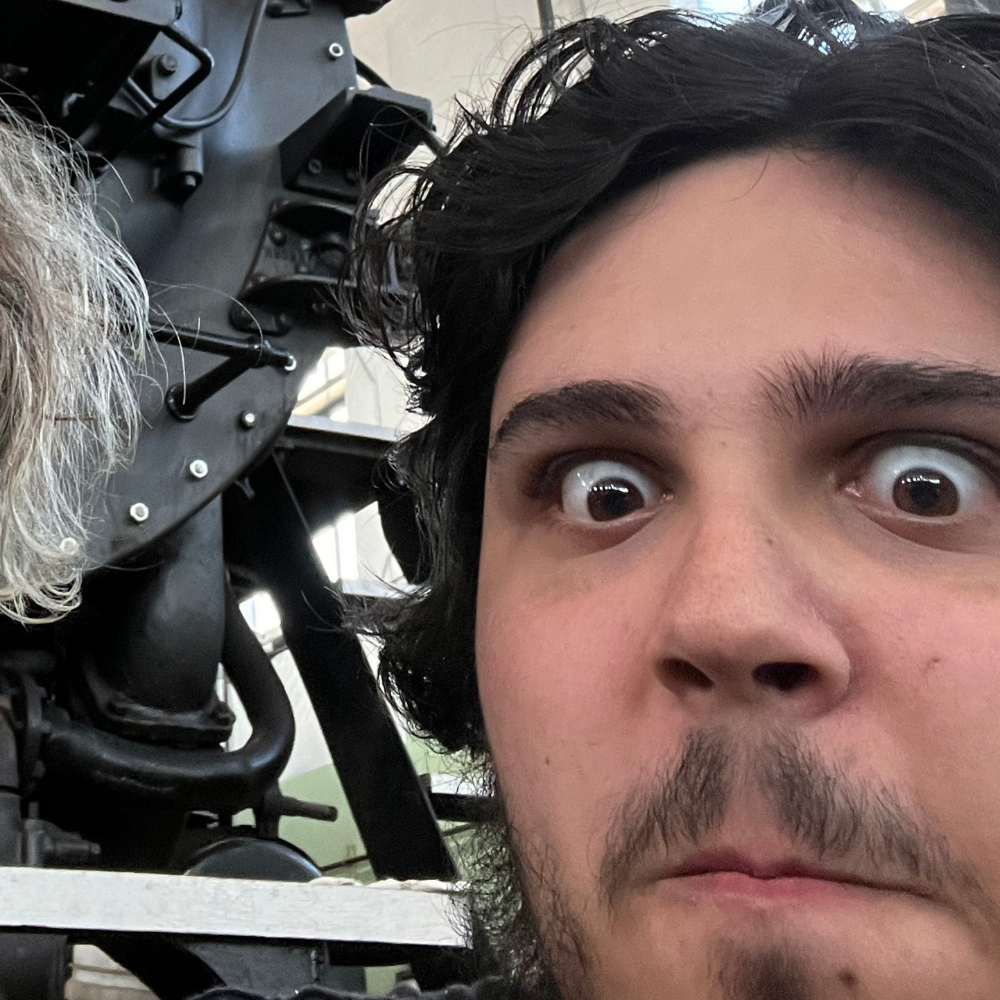
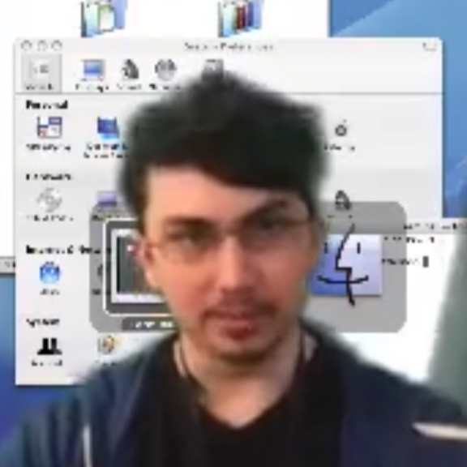
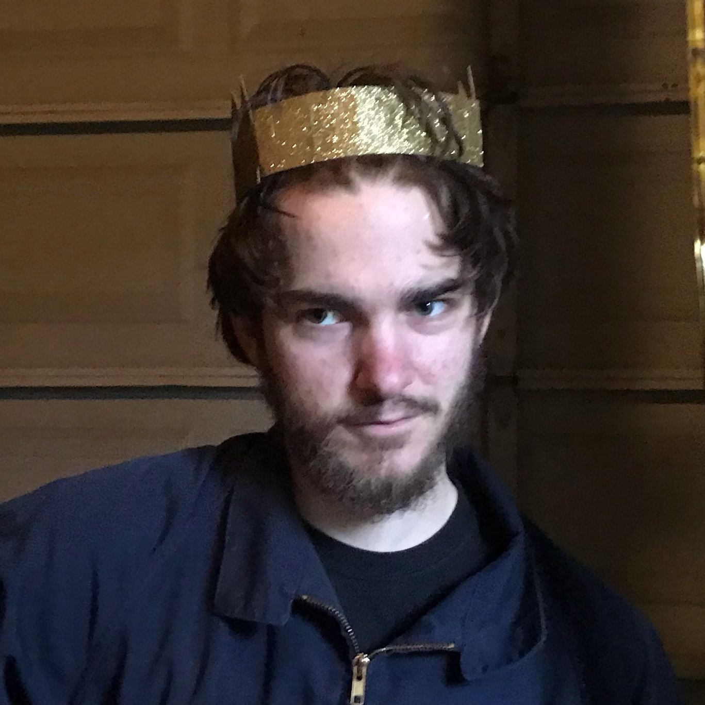

<html>

<head>
<meta http-equiv="Content-Language" content="en-us">
<meta http-equiv="Content-Type" content="text/html; charset=windows-1252">
<title>Superhome</title>
<meta name="description" content="The landing page of the superphone webzone">
</head>

<body background="Untitled564_20221218200802.png">

<table border="0" cellpadding="0" cellspacing="0" width="1220" height="1289">
	<!-- MSTableType="layout" -->
	<tr>
		<td valign="top" height="249">
		<!-- MSCellType="ContentHead" -->
		
&nbsp;

		

		SUPERPHONE: THE 
		WEBSITE

		

		HOME OF THE 
		CHICKEN MAN

		

		
		
		
		</td>
	</tr>
	<tr>
		<td width="1220" height="1040" valign="top">
		

		About 
		Us:

		

		Superphone, simply put, is a band. But that's not as fun, so we'r going 
		to get complicated. Superphone was founded in the summer of 2021 by 
		member Bea Thurman while on vacation in the California desert. It began 
		as a solo project with little aim and no consistent style or theme, 
		apart from a single song written on the plan ride home.The band truly 
		began in October of 2021 after Bea was discharged from a week long 
		hospital visit, wherein she felt compelled to finally do something with 
		the project. She went to the other two founding members, &quot;Sneeps&quot; Coffee 
		and Josh Gruin with a simple proposition, &quot;I'm doing a cover of cabinet 
		man by lemon demon, you guys want to join?&quot; Things continued steadily 
		from there, Onwards from the debut single to 2600 and then demo 
		collective. Along the way guitarist Matt &quot;Molgera&quot; was brought on to 
		assist with, well, guitar, and things have been going ever since

		
&nbsp;

		
&nbsp;

		
&nbsp;

		
&nbsp;

		
&nbsp;

		

		The Members:

		
&nbsp;

		

		O---------------BEA 
		THURMAN----------------O

		
I was 
		born in Alabama at the age of 0 in a hospital that no longer exists. 
		Raised primarily by my mother, I was exposed very early on Art and 
		Music. I began writing songs as early as elementary school. With such 
		classics as &quot;Hot Dogs for Breakfast&quot; and &quot;Fruit Cups Over Brooklyn&quot;. I 
		never really though of myself as a musician though, I was always more of 
		an artist or an animator, It wasn't until the formation of Superphone 
		that I really developed an interest in the world of music writing, 
		performing, an production. 

		
&nbsp;

		
&nbsp;

		

		O--------------&quot;Sneeps&quot; 
		Coffee---------------O

		
&nbsp;

		
[Bio 
		Soon] 

		
&nbsp;

		
&nbsp;

		
&nbsp;

		

		O----------------Josh 
		Gruin-----------------O

		
&nbsp;

		
&nbsp;

		
[Bio 
		Soon]

		
&nbsp;

		
&nbsp;

		

		O-------------Matt 
		&quot;Molgera&quot;---------------O

		
&nbsp;

		
[Bio 
		Soon]</td>
		</tr>
</table>

